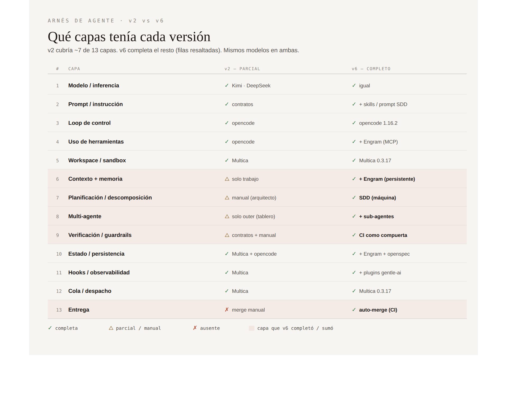

# De 7 a 13 capas: qué cambia al completar el arnés de un equipo de agentes

*Construí el mismo producto con dos versiones del mismo sistema: una con un arnés parcial (v2) y otra con el arnés completo (v6, con memoria persistente, planificación por máquina y entrega autónoma). No comparo costos absolutos —cada versión construyó una feature distinta—. Comparo el costo por feature, los retrabajos, el tiempo y, sobre todo, lo que cada arnés entrega.*

---

Un "arnés" es toda la infraestructura que rodea al modelo para convertirlo en agente. La literatura lo descompone en unas trece capas, del modelo y el loop de control a la memoria, la planificación, la verificación y la entrega. El principio que se repite: el modelo razona, el arnés actúa. En un análisis de Claude Code, el 1,6% del código es lógica del modelo y el 98,4% es arnés.

Tenía dos versiones del mismo sistema de agentes sobre un tablero Kanban. Las dos usan los mismos modelos baratos vía OpenRouter. La diferencia está en cuántas capas de arnés tiene cada una.

## El arnés de cada versión

**v2** era un arnés parcial. Cubría unas siete capas: el tablero (Multica) aportaba el workspace aislado, la cola, el despacho y el ciclo de vida; el ejecutor (opencode) aportaba el loop, las herramientas y el contexto de trabajo; y el arquitecto —una persona— aportaba los contratos y las reglas del proyecto. La descomposición de tareas la hacía el arquitecto a mano. La verificación eran contratos ejecutables más una revisión manual. El merge lo hacía una persona.

**v6** completa las capas que faltaban:

- **Memoria persistente:** v2 no tenía ninguna; v6 la suma con Engram (episódica y semántica).
- **Planificación / descomposición:** en v2 la hacía el arquitecto a mano; en v6 la hace la máquina (flujo guiado por especificación).
- **Multi-agente:** v2 tenía solo el tablero; v6 suma sub-agentes del overlay.
- **Verificación:** v2 usaba contratos más revisión manual; v6 usa el CI como compuerta automática.
- **Entrega:** v2 hacía el merge a mano; v6 lo integra solo (auto-merge gateado por CI).

En números: v2 tenía alrededor de 7 capas; v6 tiene las 13. Lo que v6 sumó es memoria, planificación por máquina, sub-agentes, verificación automática y entrega autónoma.

## Los números (lo que sí comparé)

Las dos versiones construyeron features distintas: v2 levantó el MVP completo; v6 agregó una feature de estadísticas. Por eso el costo absoluto no dice nada, y comparo por unidad. Aviso de método: tomo el costo de la factura de OpenRouter, no del número que reporta el ejecutor —ese subcuenta de forma inconsistente, entre 1,1 y 1,6 veces por debajo según la medición—.

Los números, lado a lado (v2 → v6):

- **Costo real (OpenRouter):** $1.80 por 4 tareas → ~$3.20 por 3 corridas.
- **Costo por unidad:** ~$0.45 por tarea → ~$1.07 por feature (rango $0.60–$1.50).
- **Tiempo por unidad:** ~12 min por tarea → ~11 min por feature (~10–12 min por corrida).
- **Tests al cierre:** 31 → 39.
- **Varianza de costo:** baja y predecible → ~1,8× entre corridas idénticas.

Una salvedad sobre las unidades: la "tarea" de v2 es un issue acotado; la "corrida" de v6 entrega la feature entera con su flujo de especificación. No son del mismo tamaño, así que la comparación por unidad es orientativa, no exacta. El tiempo, en cambio, jugó a favor de v6: entregar la feature en una sola corrida con especificación salió más rápido que partirla en varias tareas, porque evita recargar el contexto del repositorio en cada una.

**Retrabajos.** Acá aparece el matiz más útil. En las dos versiones, el código de los agentes salió limpio: pasó los tests, respetó el alcance, sin violaciones. La diferencia no estuvo en el código, sino en la operación. v2 fue tranquila: cuatro PRs limpios al primer intento, y las únicas intervenciones humanas fueron los merges. v6 tuvo más fricción operativa: un corte transitorio del proveedor que obligó a relanzar una corrida, y un detalle de configuración mío —resetear la rama base borró el commit que activaba el CI— que dejó un PR sin integrar. El arnés más completo tiene más piezas, y más piezas significan más puntos de falla.

## Lo que el arnés completo entrega de más

Más allá del costo, v6 deja cosas que v2 no producía:

- **Memoria que sobrevive.** Cada agente dejó registros estructurados de qué hizo y por qué. v2 perdía toda decisión al terminar la tarea.
- **Plan y especificación como artefacto.** v6 dejó documentos de exploración, propuesta, especificación, diseño y tareas en el repositorio. v2 no dejaba rastro del razonamiento detrás del código.
- **Entrega autónoma.** En v6, las tareas se integraron solas con el CI como única compuerta: cero merges manuales. En v2 los hacía todos una persona.

## Mi recomendación

Voy a ser directo, porque medí lo suficiente para tener una posición.

De todo lo que v6 agregó, **lo que claramente rinde son dos capas: la verificación con CI y la entrega autónoma.** Eliminan las intervenciones manuales de merge, son baratas de montar, y —dato importante— las aporta GitHub, no el overlay de método. Esas dos capas las sumaría a cualquier setup, incluido un v2.

Las capas pesadas del overlay —la memoria persistente y la planificación por especificación— son **condicionales**. Medí dos cosas incómodas: la memoria se escribió en cada tarea, pero no encontré evidencia de que se leyera después; y la planificación por máquina costó aproximadamente lo mismo que ir directo, pero con esa variación de 1,8 veces y una capa siempre activa que se paga corra o no. El valor de esas capas aparece en escenarios que no probé: un equipo de varias personas que comparte decisiones, features grandes con muchas alternativas de diseño, o requisitos de auditoría. Para un solo desarrollador y features acotadas, agregan costo y fragilidad sin un retorno que haya podido demostrar.

Dicho de otro modo: **el salto de v2 a "arnés completo" mejora sobre todo por dos capas baratas; el resto del arnés pesado conviene incorporarlo cuando el escenario lo justifique, no por defecto.** Un arnés más completo no es automáticamente mejor. Es más capaz y más caro de operar, y conviene sumar cada capa solo cuando se va a usar.

## Cuándo valen las capas que no usé

Que la memoria y la planificación por especificación no rindieran acá no las descalifica: depende del tamaño y la vida del proyecto. Mi lectura, por escenario:

- **Proyecto muy chico, una sola feature, un desarrollador, descartable:** no las uses. La memoria no tiene a quién servirle —no hay una segunda sesión que la lea— y la planificación por especificación agrega costo y variación sin un plan que valga la pena documentar. El stack mínimo (contratos + CI + auto-merge) alcanza y sobra; acá el overlay pesado es lastre.
- **Proyecto mediano, varias features, un desarrollador:** la planificación por especificación empieza a pagar en las features con decisiones de diseño reales —varias alternativas, tradeoffs—; en las mecánicas sigue siendo overhead. La memoria todavía rinde poco si se trabaja solo.
- **Proyecto grande, equipo, larga vida:** acá las dos pagan. La memoria se vuelve referencia compartida entre personas y entre features; las especificaciones son el rastro que un equipo necesita para entender por qué se hizo algo.
- **Con requisitos de auditoría:** las especificaciones y la memoria valen sin importar el tamaño —son justo lo que un auditor pide—.

La regla práctica: cuanto más chico y efímero el proyecto, más conviene el arnés mínimo. Las capas pesadas se justifican cuando hay continuidad —entre sesiones, entre personas, entre features— o cuando alguien, más tarde, va a preguntar "por qué se hizo así".

## El cierre

La pregunta útil no es "¿cuál versión es mejor?", sino "¿qué capa de arnés necesito para este trabajo?". v2 era un arnés parcial, predecible y barato. v6 es completo, más capaz y más variable. Entre las dos, la lección no es elegir una, sino entender que cada capa tiene un costo y un escenario donde paga. La mayoría de las veces, las dos capas que más rinden son las más simples de agregar.

## Próximo paso: modelos locales

Todo el análisis de costo de este texto asume modelos de pago, facturados por token a través de un gateway. Eso arrastra tres cosas que vimos de cerca: el costo variable, los límites de la key que llegaron a bloquear una corrida, y los cortes transitorios del proveedor. El próximo paso es sacarlos de la ecuación: correr modelos locales.

Con un modelo local autohospedado, el costo por token desaparece y se vuelve un costo fijo de infraestructura; los límites de cuota y los timeouts del proveedor también se van. El trade-off es conocido: hoy los modelos locales que corren en hardware accesible son más débiles y más lentos que Kimi o DeepSeek, y hace falta una máquina que los sostenga. Pero para buena parte del trabajo —sobre todo las capas baratas que ya demostraron rendir, y las tareas mecánicas— la pregunta deja de ser "cuánto sale cada feature" y pasa a ser "qué corre bien sin pagar por token".

Ese es el experimento que sigue: el mismo arnés, los mismos contratos, pero con el modelo movido de la nube a la máquina. Si el arnés es donde está casi todo el sistema —y los datos de este texto apuntan a eso—, el modelo debería poder cambiarse por uno local sin rehacer el resto.

---

**Repositorios y referencia:**
- AgentCode — scripts, documentación y la referencia de capas: github.com/rubenaros/AgentCode
- petdesk-v2 — el repositorio del experimento (ramas por versión): github.com/rubenaros/petdesk-v2
